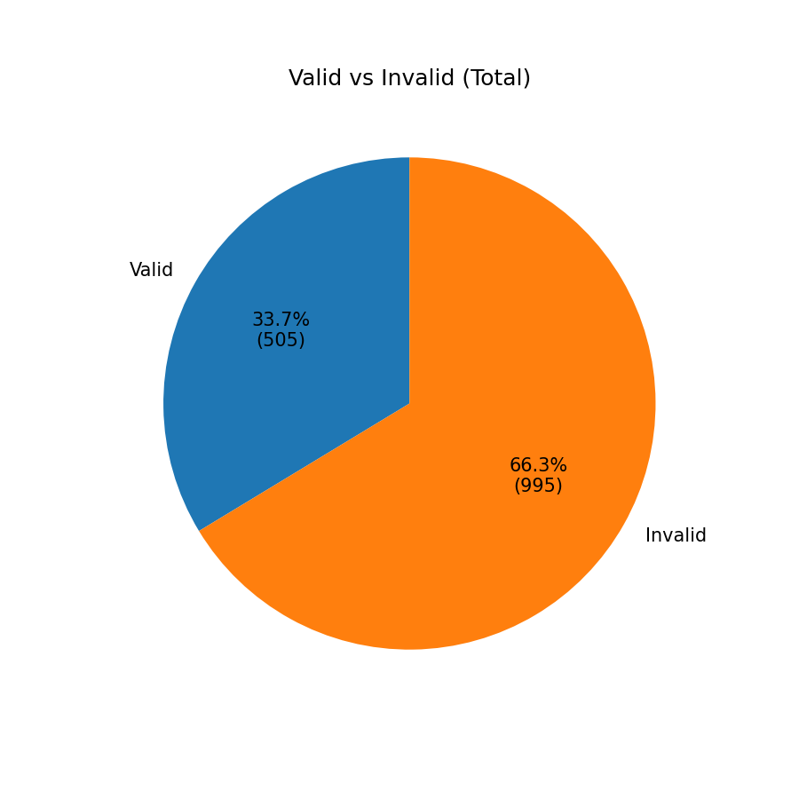
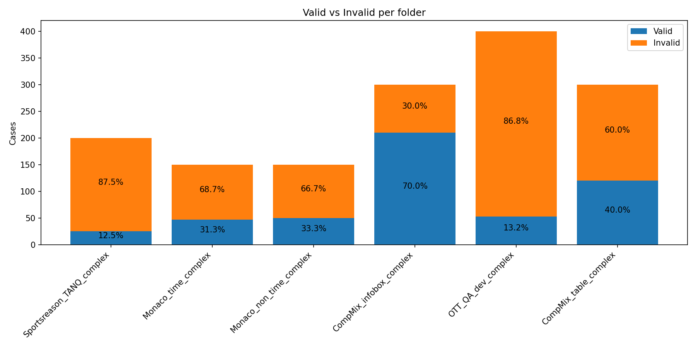
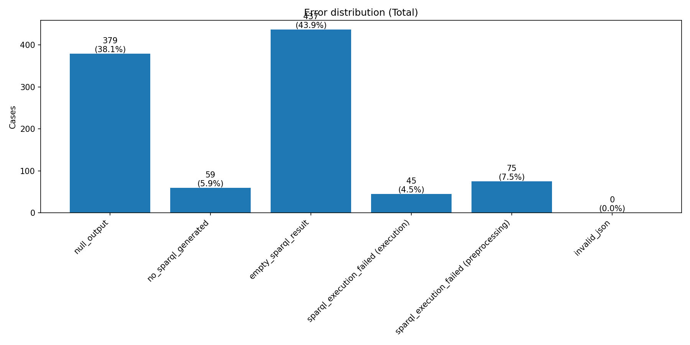
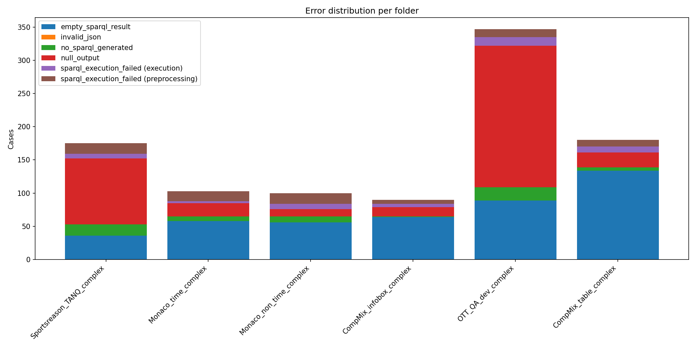

# Global SPARQL QA Statistics

## Overall valid vs invalid

| Metric | Count | Percentage |
|---|---|---|
| Valid | 505 | 33.67% |
| Invalid | 995 | 66.33% |

## Error distribution (Total)

| Error type | Count | % of invalid |
|---|---|---|
| empty_sparql_result | 437 | 43.92% |
| invalid_json | 0 | 0.00% |
| no_sparql_generated | 59 | 5.93% |
| null_output | 379 | 38.09% |
| sparql_execution_failed (execution) | 45 | 4.52% |
| sparql_execution_failed (preprocessing) | 75 | 7.54% |

## Per-folder summary

| Folder | Total | Valid | Valid % | Invalid | Invalid % |
|---|---|---|---|---|---|
| Sportsreason_TANQ_complex | 200 | 25 | 12.50% | 175 | 87.50% |
| Monaco_time_complex | 150 | 47 | 31.33% | 103 | 68.67% |
| Monaco_non_time_complex | 150 | 50 | 33.33% | 100 | 66.67% |
| CompMix_infobox_complex | 300 | 210 | 70.00% | 90 | 30.00% |
| OTT_QA_dev_complex | 400 | 53 | 13.25% | 347 | 86.75% |
| CompMix_table_complex | 300 | 120 | 40.00% | 180 | 60.00% |
| **Total** | 1500 | 505 | 33.67% | 995 | 66.33% |

