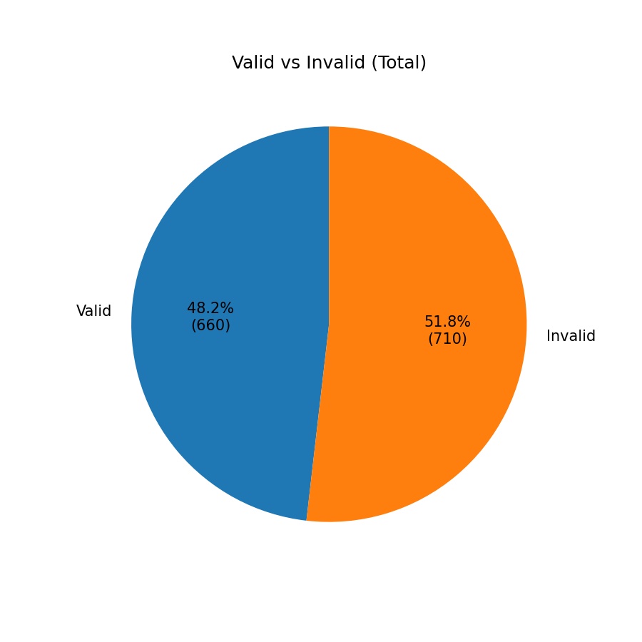
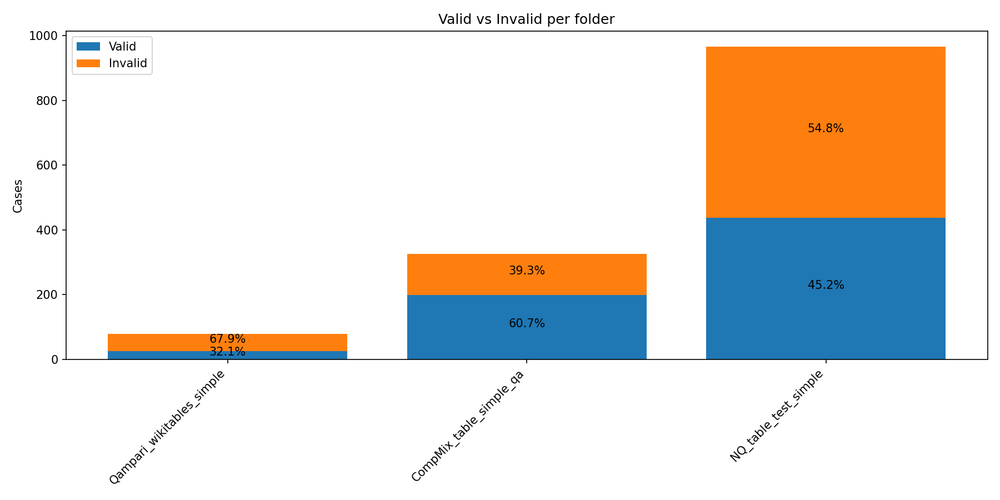
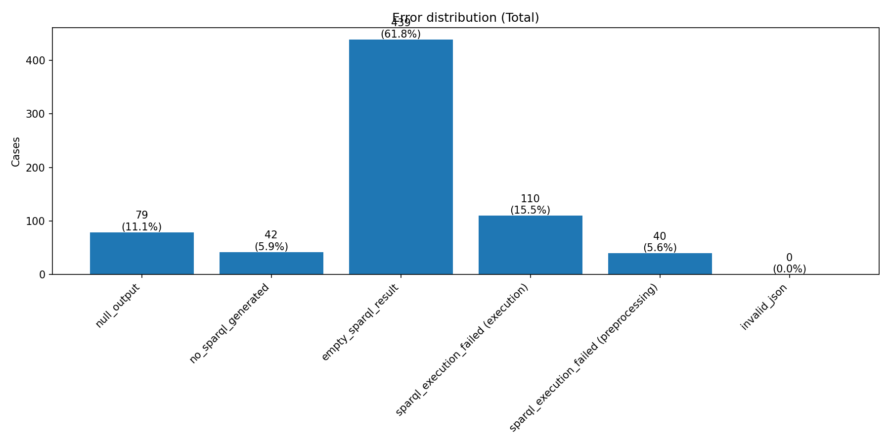
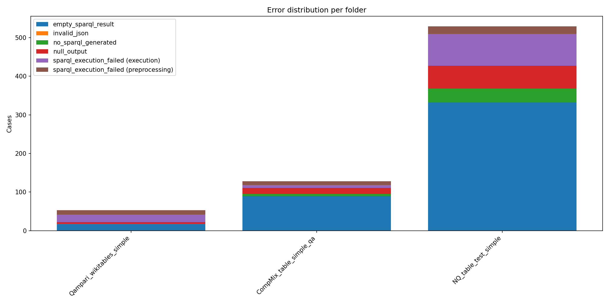

# Global SPARQL QA Statistics

## Overall valid vs invalid

| Metric | Count | Percentage |
|---|---|---|
| Valid | 660 | 48.18% |
| Invalid | 710 | 51.82% |

## Error distribution (Total)

| Error type | Count | % of invalid |
|---|---|---|
| empty_sparql_result | 439 | 61.83% |
| invalid_json | 0 | 0.00% |
| no_sparql_generated | 42 | 5.92% |
| null_output | 79 | 11.13% |
| sparql_execution_failed (execution) | 110 | 15.49% |
| sparql_execution_failed (preprocessing) | 40 | 5.63% |

## Per-folder summary

| Folder | Total | Valid | Valid % | Invalid | Invalid % |
|---|---|---|---|---|---|
| Qampari_wikitables_simple | 78 | 25 | 32.05% | 53 | 67.95% |
| CompMix_table_simple_qa | 326 | 198 | 60.74% | 128 | 39.26% |
| NQ_table_test_simple | 966 | 437 | 45.24% | 529 | 54.76% |
| **Total** | 1370 | 660 | 48.18% | 710 | 51.82% |

